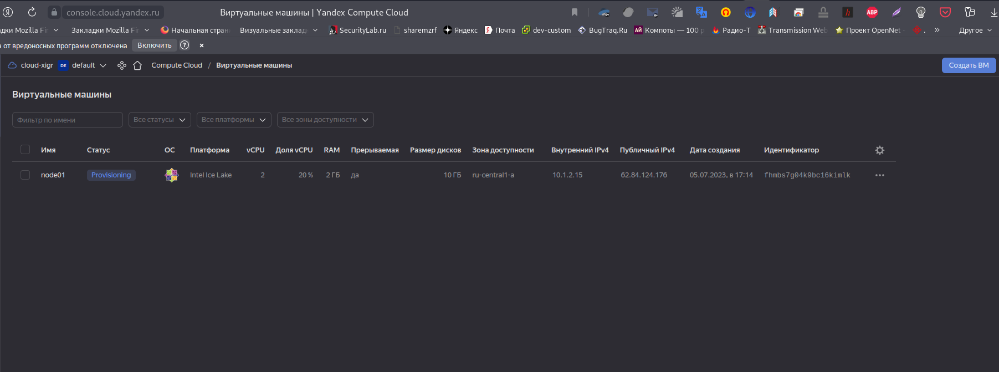

# Домашнее задание к занятию "`Оркестрация группой Docker-контейнеров на примере Docker Compose`" - `Живарев Игорь`

### Задание 1

Создайте собственный образ любой операционной системы (например ubuntu-20.04) с помощью Packer (инструкция).

Чтобы получить зачёт, вам нужно предоставить скриншот страницы с созданным образом из личного кабинета YandexCloud.

Ответ:

---

### Задание 2

Создайте вашу первую виртуальную машину в YandexCloud с помощью web-интерфейса YandexCloud.

Ответ:

---

### Задание 3

С помощью ansible+docker-compose разверните на виртуальной машине из предыдущего задания систему мониторинга на основе Prometheus/Grafana . Используйте ansible код в директории (src/ansible)

Для получения зачета вам необходимо предоставить вывод команды "docker ps" , все контейнеры, описанные в (docker-compose), должны быть в статусе "Up".

Ответ:

### Задание 4

Откройте веб-браузер, зайдите на страницу http://<внешний_ip_адрес_вашей_ВМ>:3000.
Используйте для авторизации логин и пароль из .env-file.
Изучите доступный интерфейс, найдите в интерфейсе автоматически созданные docker-compose-панели с графиками(dashboards).
Подождите 5-10 минут, чтобы система мониторинга успела накопить данные.

Ответ:

